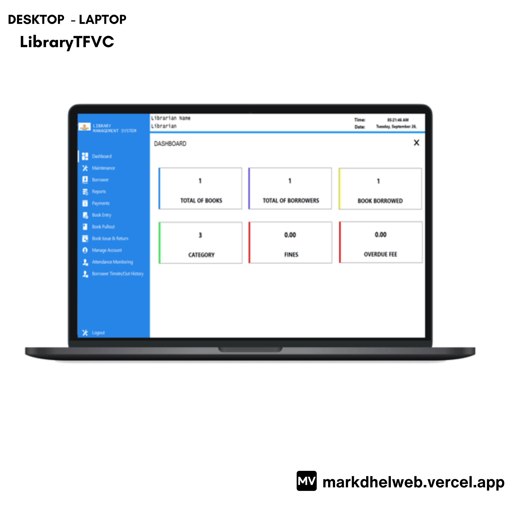

<!-- markdownlint-configure-file {
  "MD013": {
    "code_blocks": false,
    "tables": false
  },
  "MD033": false,
  "MD041": false
} -->

  

# LibraryTFVC 

This application maintain the database of new books as well as the books that are borrowed by users, along with their due dates

## Features

- Login(Validation,Verification,CaseSensitive,ForgotPassword)
- Monitoring Dashboard
- Maintenance(LibrarySetup,Category,Publisher,Author,Department,StudentLevel,Section,Supplier)
- Borrower(Import Student/ Generate Library Card)
- Book Entry
- Book(Borrowing,Return,DueDate,Lost/Damage,Fines)
- Attendance Monitoring
- Reports(MasterList,Borrowed,OverDue,OverDueList,FinesList,LogHistory,BookReturned,TimeIn-TimeOut)

## Built With

- [VB.NET](https://learn.microsoft.com/en-us/dotnet/desktop/winforms/overview/?view=netdesktop-7.0) - i use windows form to develop
- [SqlServer](https://www.microsoft.com/en-us/sql-server/sql-server-downloads) - i use it for database
- [CrystalReport](https://www.sap.com/index.html) - to generate reports
- [Guna](https://gunaui.com/) - to create cool UI too

## Software Development

Demo: [Coming Soon - I've been schedule for this as of now i don't have available schedule thanks!]

🪟: [Desktop - Laptop]

